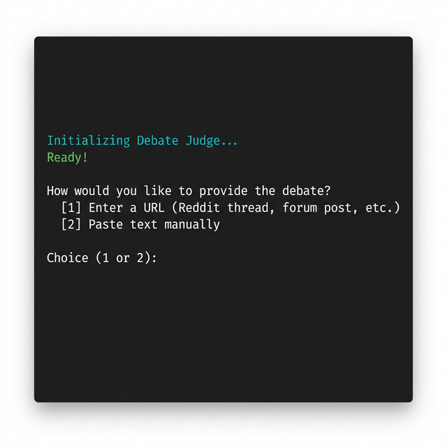
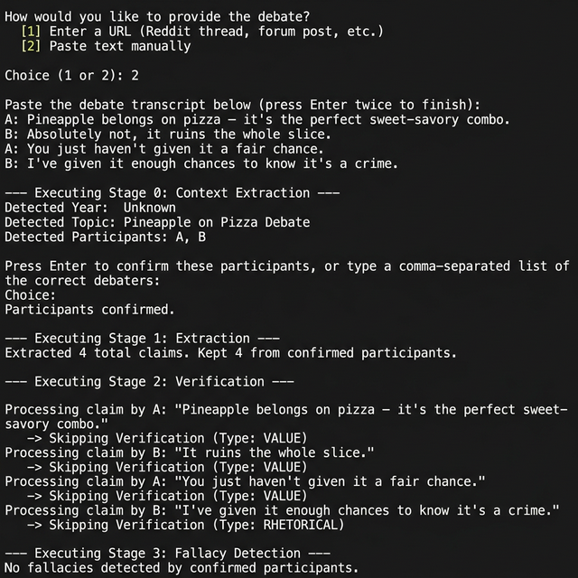
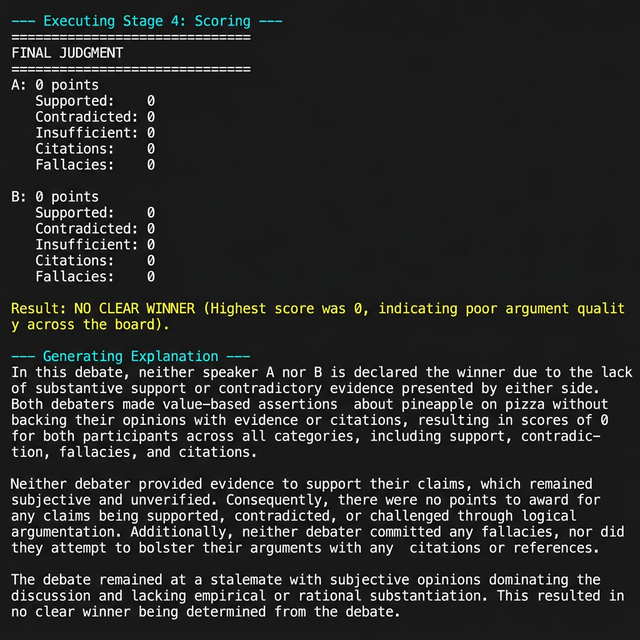

# Debate Judge — A Reasoning Evaluation Agent

Debate Judge is an AI system that analyzes a debate and determines which speaker presented the stronger argument using **structured reasoning**, **evidence verification**, and **deterministic scoring**.

> Unlike a chatbot, Debate Judge does not "pick a side."  
> It evaluates argument quality by extracting claims, verifying them against evidence, detecting logical fallacies, and applying a reproducible scoring function.

This project demonstrates **LLM orchestration and tool-augmented reasoning**, not conversation.

---

## Architecture Overview

Debate Judge is **not** a conversational agent.  
It is a reasoning pipeline where large language models perform analysis while Python code performs judgment.

The system deliberately separates responsibilities:

| Layer | Responsibility |
|-------|----------------|
| **LLM** | Language understanding and evidence comparison |
| **Python** | Scoring, routing, and final decision |

> The model never directly decides the winner.

### High-Level Flow

```
                 User Debate
                 (URL or Text)
                       │
                       ▼
          ┌────────────────────────┐
          │   Stage 0: Context     │
          │   (Year, Topic, Devs)  │
          └────────────────────────┘
                       │
                       ▼
          ┌────────────────────────┐
          │  Stage 1: Extraction   │
          │   (Structured JSON)    │
          └────────────────────────┘
                       │
                       ▼
          ┌────────────────────────┐
          │  Claim Type Classifier │
          └────────────────────────┘
                      │
                      ▼
              Complexity Router
         (Fast Model vs Reasoning Model)
          │                       │
    FACTUAL                CAUSAL / STATISTICAL
    gpt-4o-mini               gpt-4o
          │                       │
          └───────────┬───────────┘
                      ▼
          ┌────────────────────────┐
          │ Evidence Retrieval Tool│
          │     (Wikipedia API)    │
          └────────────────────────┘
                      │
                      ▼
          ┌────────────────────────┐
          │   Claim Verification   │
          │ (Evidence Comparison)  │
          └────────────────────────┘
                      │
                      ▼
          ┌────────────────────────┐
          │   Fallacy Detection    │
          └────────────────────────┘
                      │
                      ▼
          ┌────────────────────────┐
          │ Deterministic Scoring  │
          │      (Python Only)     │
          └────────────────────────┘
                      │
                      ▼
          ┌────────────────────────┐
          │   Winner Selection     │
          └────────────────────────┘
                      │
                      ▼
          ┌────────────────────────┐
          │ LLM Explanation Layer  │
          │ (Grounded in results)  │
          └────────────────────────┘
                      │
                      ▼
                Final Judgment
```

---

## How It Works

The debate is converted into structured reasoning units and evaluated step-by-step.

### 0. Context Extraction & Filtering
Examines the beginning of the text to identify the **Year**, **Topic**, and **True Participants**. The user confirms the participants to automatically filter out moderators and audience members from scoring.

### 1. Claim Extraction
Converts the full text into atomic claims, each tagged with a type:

| Type | Description |
|------|-------------|
| `FACTUAL` | Objective statement about a past/present event or study result |
| `STATISTICAL` | Claim involving specific numbers, rates, or data |
| `CAUSAL` | Asserts that one thing causes another |
| `VALUE` | Subjective judgment, moral statement, or future prediction |
| `RHETORICAL` | Personal attack or purely persuasive statement with no factual content |

### 3. Complexity Routing
`FACTUAL` claims use the cheaper `gpt-4o-mini` model for verification.  
`CAUSAL` and `STATISTICAL` claims use the stronger `gpt-4o` model.  
`VALUE` and `RHETORICAL` claims are skipped entirely.

### 3. Evidence Retrieval & Smart Routing
Verifiable claims are verified via web searches.
- `FACTUAL` / `CAUSAL` claims -> Searched on **Wikipedia** first, fallback to DuckDuckGo.
- `STATISTICAL` claims -> Searched on **DuckDuckGo** first (better for specific numbers).

### 4. Claim Verification
Each claim is classified as:
- `SUPPORTED` — Evidence broadly consistent with the claim
- `CONTRADICTED` — Evidence explicitly opposes the claim
- `INSUFFICIENT` — Evidence is off-topic or not found

### 5. Fallacy Detection
The system checks for:
- **Ad Hominem** — Attacking the person, not the argument
- **Strawman** — Misrepresenting the opponent's argument
- **False Cause** — Assuming correlation implies causation
- **Hasty Generalization** — Broad claim from insufficient evidence
- **Moving Goalposts** — Changing criteria mid-debate

### 6. Deterministic Scoring
Python code calculates argument strength for confirmed participants only — no LLM involved.

### 7. Explanation Generation
The LLM produces a grounded explanation using the structured results.

---

## Scoring System

| Event | Points |
|-------|--------|
| Supported claim | **+2** |
| Provided citation | **+1** |
| Insufficient evidence | **−1** |
| Contradicted claim | **−2** |
| Logical fallacy | **−3** |

The winner is selected purely by score. The model only explains the result afterward.  
*Note: A speaker must achieve a score **> 0** to win. If all scores are 0 or below, the result is declared "No Clear Winner".*

---

## Usage & Screenshots

Run the program from the `debate_judge/` directory:

```bash
python main.py
```

### Step 1 — Startup & Input Method

On launch, the system initializes all components and prompts you to choose how to provide the debate: via a URL or by pasting text directly.



### Step 2 — Pipeline Execution

After pasting the transcript and confirming participants, the system runs through all stages: context extraction, claim extraction, verification routing, and fallacy detection. `VALUE` and `RHETORICAL` claims are automatically skipped during verification.



### Step 3 — Final Judgment & Explanation

The scoring stage tallies points per participant. If no speaker achieves a score above 0 (e.g., all claims were subjective and unverifiable), the system declares **No Clear Winner**. A grounded LLM explanation is generated based solely on the structured results.



---

## Example Output (Factual Debate)

```
Speaker A: -7 points
  Supported:    0
  Contradicted: 3
  Insufficient: 0
  Citations:    0
  Fallacies:    1  (Hasty Generalization)

Speaker B: +4 points
  Supported:    2
  Contradicted: 0
  Insufficient: 0
  Citations:    0
  Fallacies:    0

Winner: Speaker B

Explanation:
Speaker A relied on unsupported statistical claims and personal attacks.
Speaker B supported their claims with verifiable evidence.
```

---

## Project Structure

```
debate_judge/
│
├── main.py              # Entry point — orchestrates the full pipeline
├── extractor.py         # Stage 0/1: Context and Claim extraction
├── verifier.py          # Stage 2: Evidence-based claim verification
├── fallacy.py           # Stage 3: Logical fallacy detection
├── scoring.py           # Stage 4: Deterministic scoring (no LLM)
├── router.py            # Complexity routing and model selection
│
├── tools/
│   ├── wikipedia_tool.py  # Wikipedia evidence retrieval
│   ├── duckduckgo_tool.py # DuckDuckGo web search fallback
│   └── web_scraper.py     # Debate URL text extraction (Reddit, URLs)
│
├── prompts/
│   ├── context.txt      # System prompt for context extraction
│   ├── extract.txt      # System prompt for claim extraction
│   ├── verify.txt       # System prompt for claim verification
│   └── fallacy.txt      # System prompt for fallacy detection
│
├── mocks.py             # Offline mock classes for testing
├── test_debate_judge.py # Unit and integration tests
└── requirements.txt
```

---

## Installation

**1. Clone the repository:**
```bash
git clone https://github.com/yourname/debate-judge.git
cd debate-judge
```

**2. Create and activate a virtual environment:**
```bash
# Create
python -m venv .venv

# Activate — Windows
.venv\Scripts\activate

# Activate — Mac/Linux
source .venv/bin/activate
```

**3. Install dependencies:**
```bash
pip install -r requirements.txt
```

**4. Create a `.env` file:**
```
OPENAI_API_KEY=your_api_key_here
```

---

## Running

```bash
python main.py
```

When prompted, you can either:
1. **Submit a URL** (e.g., a CNN transcript, Reddit debate thread). The scraper will automatically extract the text.
2. **Paste a transcript** manually, then press **Enter twice** to submit.

**Example text input:**
```
A: Crime has increased every year.
B: FBI statistics show crime decreased in 2022.
A: Those statistics are unreliable and you clearly don't understand economics.
```

The system will detect the participants, ask for your confirmation, and then run the full pipeline.

**Running tests (no API key required):**
```bash
python -m pytest test_debate_judge.py -v
```

---

## Troubleshooting

### `ModuleNotFoundError: No module named 'ddgs'`

This error occurs with `duckduckgo-search` **v6+**, which changed its internal package name. The import in `tools/duckduckgo_tool.py` was updated from:

```python
# Old (broken with duckduckgo-search >= 6.0)
from ddgs import DDGS
```

to:

```python
# Correct import for duckduckgo-search >= 6.0
from duckduckgo_search import DDGS
```

If you encounter this error after a fresh install, ensure you are using the version pinned in `requirements.txt`:

```
duckduckgo-search>=6.0.0
```

And that the import in `tools/duckduckgo_tool.py` uses `from duckduckgo_search import DDGS`.

---

## Limitations

- Wikipedia summaries and DuckDuckGo snippets may be incomplete or lack deep context.
- Philosophical and future-tense claims cannot be externally verified.
- Fallacy detection is heuristic and may miss subtle cases.
- Scoring weights are manually chosen and fixed.

> This is a research prototype, not a truth engine.

---

## Why This Project Exists

Most LLM demos show conversation.  
Real AI systems require:

- **Structured outputs** — JSON from every LLM call, not free text
- **Tool usage** — External data sources grounded in facts
- **Verification** — Claims checked against neutral evidence
- **Deterministic decisions** — Python decides the winner, not the model

Debate Judge demonstrates how LLMs can function as **analytical components** inside reliable software systems rather than autonomous decision-makers.